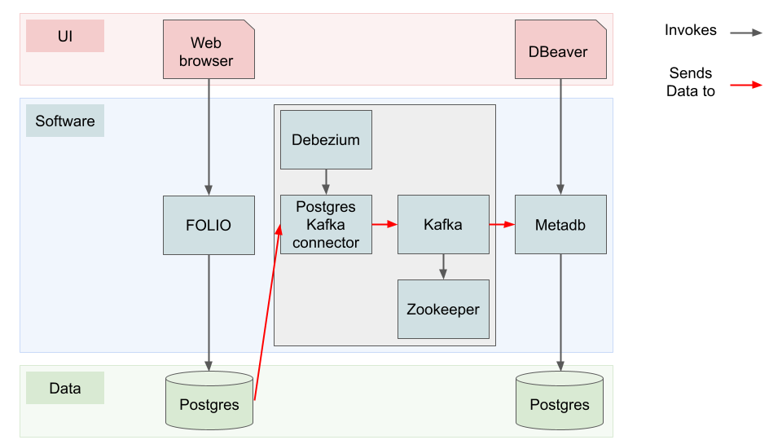

== Developer's Guide

I (Mike) intend to add developer documentation reflecting my learning as I read the code and consult Nassib. The following skeleton is work in progress, and *will be of no use to anyone but me*, for now at least.


=== Directory structure

The Metadb source code is found at https://github.com/metadb-project/metadb

The top level directory contains the following files and directories:

* `LICENSE` -- Apache license v2.0
* `README.md` -- Brief highest-level documentation
* `go.mod` -- The standard https://go.dev/doc/modules/gomod-ref[Go module declaration]
* `go.sum` -- Checksum file for dependencies referenced in `go.mod`
* `cmd` -- _All_ source code, for commands and underlying functionality
* `.errcheck` -- Configuration file for Go linting program `errcheck`
* `build.sh` -- Shell-script to build Metadb
* `tools.go` -- Register of https://go.dev/wiki/Modules#how-can-i-track-tool-dependencies-for-a-module[Go-based tools] used in build.
* `doc` -- Documentation in https://asciidoc.org/[AsciiDoc] format


==== Within the `doc` directory

`metadb.adoc` is the top-level documentation file, which includes the other AsciiDoc files. These files can be viewed locally in a browser with the https://addons.mozilla.org/en-GB/firefox/addon/asciidoctorjs-live-preview/[Asciidoctor.js Live Preview] extension.

The AsciiDoc files can be compiled to HTML using `asciidoctor -a docinfo=shared *.adoc`, and https://metadb.dev/doc/[the Metadb documentation website] is generated in this way. The only other file in the `doc` directory is `docinfo.html`, which provides CSS styling for the generated HTML.


==== Within the `cmd` directory

The code is broken into four areas:

* `metadb` is the code of the core binary of the name name. We will return to this area.
* `mdb` is an old client for the `metadb` server. Since we now use `psql` as the command-line API for Metadb this is legacy code and should probably be removed. We will not describe it further.
* `marct` is a thin command-line interface for the MARC-transformation code in Metadb. It allows that transformation to be run stand-alone, for example so the results can be injected into an LDP Classic database.
* `internal` contains several chunks of utility code used in multiple contexts, of which:
  ** `internal/api` contains definitions of types shared between different programs (e.g. `metadb` and `mdb`).
  ** `internal/color` defines colours to be used for different logging levels by `eout`.
  ** `internal/common` contains shared constant definitions -- at present, just the default port-number for Metadb to listen on.
  ** `internal/eout` contains functions for logging to standard error (`Error`, `Warning`, `Info`, etc.)
  **  `internal/libmarct` is by far the most substantial, the MARC-record transformer.
  ** `internal/status` contains a simple enumeration for the status of a source connector.
  ** `internal/uuid` contains simple functions to convert UUIDs between their standard library representation and that used by Postgres.

All the code is very sparsely commented, usually just with short one-line comments before stanzas of code within functions.


===== Within the `cmd/metadb` directory

XXX


=== Setting up a Metadb service for FOLIO


==== Overview

(See also https://metadb.dev/doc/#_system_requirements[System Reqirements in the Metadb Server Administration guide].)

There are a lot of moving parts involved in getting FOLIO data into Metadb: Postgres, Kafka Connect, Debezium, Kafka, Zookeeper, and a second instance of Postgres, as well as Metadb itself. It can be difficult to keep straight how they all fit together.

* Postgres holds the data of the running FOLIO system. It can be configured (see below) to log its change events to a _replication slot_, which is internal to the database. In principle, Metadb could read these change events directly from the replication slot, but there are lots of reasons why this would not be the best approach. Instead:
* Debezium reads change events and makes them available for Metadb:
  ** A Postgres connector from Kafka Connect is controlled by Debezium to read the change events from the replication log.
  ** Kafka accepts the events fed to it by Debezium (the producer), and buffers them for reading by Metadb (the consumer).
    *** Zookeeper is used by Kafka to co-ordinate the cluster, but is not _directly_ involved in handling change events.
* Metadb reads the change events from Kafka and plays them into its own instance of Postgres.

In the diagram below, user-interface components are shown in red, underlying software in blue, and data-stores in green. The grey box in the middle represents the Debezium agregate: Debezium itself and the components that it manages. We don’t have to think much about Kafka Connect, Kafka or Zookeeper, because they are all part of the Debezium “black box”.

// Exported as PNG from https://docs.google.com/presentation/d/1405stn-Vtjw2RA3nYQ9C8bEFytmv6Le6gRhTNFwEBI4/edit#slide=id.p


Many different network arrangements are possible here, with the source Postgres database, Debezium, the Kafka cluster and Metadb's Postgres database potentially all being on different servers, or running in different containers.

We will now consider these components individually.


==== FOLIO Postgres database

https://folio.org/[The FOLIO library services platform] stores its data in a https://www.postgresql.org/[PostgreSQL] database. Most of the database's configuration is established as part of setting up FOLIO. One further step is necessary if the database it to be analyzed by Metadb. To allow capturing data changes in the source PostgreSQL database, logical decoding has to be enabled by setting `wal_level = logical` in `postgresql.conf`.


==== Kafka

Kafka servers are known as "brokers". Several brokers may make up a Kafka cluster.

XXX Does a consumer connect to a cluster, or to a specific broker?

XXX


==== Kafka Connect

XXX


==== Debezium

"Debezium is built on top of Apache Kafka and provides a set of Kafka Connect compatible connectors."
-- from https://debezium.io/documentation/reference/2.6/tutorial.html[the Debezium tutorial]


==== Metadb Postgres database

Metadb requires https://www.postgresql.org/[the PostgreSQL database] at version 15 or later.

XXX


==== Metadb

The reference operating system Debian GNU/Linux version 12 or later, but work is under way to ensure that Metadb also builds and runs on Mac OS 12.7.4 (Monterey) and later.

Metadb is written in https://go.dev/[Go] and requires version 1.21 or later.

===== Metadb prerequisites

External programs are needed for the build process. Some (e.g. `goyacc`) are pulled in by Go automatically thanks to the top-level `tools.go` file, but others are not written in Go and so cannot be installed in this manner.

These include:

* https://pkg.go.dev/golang.org/x/tools/cmd/goyacc[goyacc], a parser generator written in Go. It can be installed using `go install golang.org/x/tools/cmd/goyacc@master`

* https://www.colm.net/open-source/ragel/[Ragel], a state machine compiler written in an undocumented language called Colm, which in turn is written in C++. This must be installed in an operating-system-dependent manner before Metadb can be compiled. For example:
  ** On Debian-like operating systems: `sudo apt install ragel`
  ** On MacOS with Homebrew installed: `brew install ragel` (_not_ with `sudo`)


===== Metadb main build

At the top level, run `./build.sh`. (A Unix-like shell is required.)


===== Metadb tests

Test coverage is presently weak, but the tests can be run using:
```
go test -coverprofile=c.out ./cmd/...
```
As a side-effect, this generates a coverage file, `c.out`, which can be transformed into browsable HTML report using:
```
grep -v '\.rl:' c.out > c2.out
go tool cover -html=c2.out
```
(It's necessary to remove the lines about `.rl` files from the coverage file, as they confuse the coverage tool and result in its reporting `cover: inconsistent NumStmt: changed from 1 to 2`. These entries arise from the coverage tool's inability to handle `//line` directives in generated source files.)

Or you can generate function-by-function textual output of the coverage analysis using:
```
go tool cover -func=c2.out | sed 's/^github.com\/metadb-project\/metadb\///'
```


=== Connecting to a remote Metadb service

Any Postgres client can be used with Metadb -- for example https://dbeaver.io/[DBeaver]. But the simplest option is the Postgres command-line client, `psql`. Invoke it as follows:
```
psql -h id-test-metadb.folio.indexdata.com  -d metadb_indexdata_test -U miketaylor
```
or
```
psql postgresql://miketaylor@id-test-metadb.folio.indexdata.com:5432/metadb_indexdata_test?sslmode=require
```
or
```
psql "sslmode=require host=id-test-metadb.folio.indexdata.com dbname=metadb_indexdata_test user=miketaylor"
```
(The `sslmode=require` query parameter must be specified in the second and third forms, since no encryption is used by default, and most servers will for this reason reject the connection.)

Then you can analyse data using queries such as:
```
metadb_indexdata_test=> select jsonb_extract_path_text(jsonb, 'fundDistribution', '0', 'code') as fundDistributionCode from folio_orders.po_line limit 10;
 funddistributioncode 
----------------------
 ejl
 j-chem
 DDT
 ENDOW-SUBN
 facpubhutch
 TEST2
 AFRICAHIST
 GIFT-SUBN
 j-chem
 ejl
(10 rows)
```


=== Features

* The list of top-level features mentioned at the start of https://metadb.dev/doc/[the user documentation] is probably worth using as a high-level overview of the code:
  ** streaming data sources
    *** In principle, multiple kinds of source: so far, only kafka
  ** data model transforms
  ** historical data


